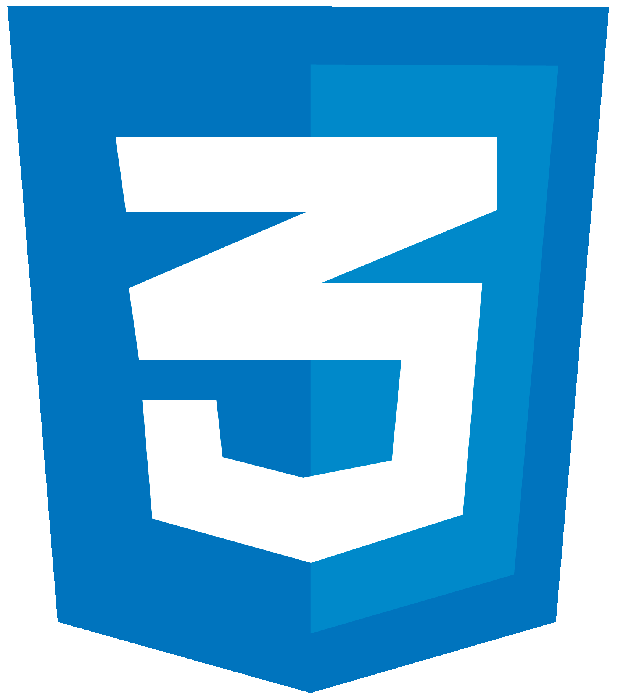

<h1 align="center"> Jogo da Adivinhação </h1> 


## Índice
* [Índice](#índice)

* [Descrição](#descrição)

* [Status](#barchart-status)

* [Acesso ao Projeto](#computer-acesso-ao-projeto)

* [Abra e Personalize](#package-abra-e-personalize)

* [Como Jogar](#videogame-como-jogar)

* [Tecnologias Utilizadas](#tecnologias-utilizadas)

* [Autor](#autor)


## Descrição
O projeto consiste em um jogo de adivinhação que funciona através do reconhecimento de voz onde um número aleatório é sorteado dentro de um intervalo de valores e, dependendo do nível de dificuldade que o jogador escolher, terá um número limitado de tentativas para tentar adivinhar o número escolhido através da fala.

## :bar_chart: Status
O projeto está na sua versão 1.0 e está pronto para uso. Atualizações sucintas virão no futuro.

## :computer: Acesso ao Projeto
Você pode acessar o jogo através deste link:
<br>
https://jogo-da-adivinhacao.vercel.app/

Ou <a href="https://github.com/pedromessetti/jogo-da-adivinhacao/archive/refs/heads/main.zip">clique aqui</a> para baixar o arquivo e modificá-lo como quiser.

## :package: Abra e Personalize
Após baixar o arquivo _.zip_, descompacte-o e abra a pasta com o Visual Studio Code ou com o editor de código que preferir. Divirta-se editando e personalizando o jogo da sua maneira, mude os estilos, cores, mensagens, altere o número de tentativas, os valores mínimos e máximos, os botões e muito mais.

**Caso venha a postar suas modificações não se esqueça de me marcar! @pedromessetti em todas as redes sociais.**

## :video_game: Como Jogar
Ao iniciar o jogo terá de selecionar o nível de dificuldade e clique no botão "Jogar":

`Fácil: 20 tentativas` | `Médio: 15 tentativas` | `Difícil: 10 tentativas`

:exclamation:Poderá personalizar o número de tentativas acessando o arquivo _start.js_ e altere através da função:
```
function nivelDificuldade(dificuldade) {
    if(dificuldade == "Fácil") {
        return 20 //Número de tentativas
    }

    if(dificuldade == "Médio") {
        return 15 //Número de tentativas
    }

    if(dificuldade == "Difícil") {
        return 10 //Número de tentativas
    }
}
```
Após clicar em "Jogar" basta dizer seu chute, o reconhecimento de voz irá captar o valor dito e caso não seja um valor dentro do intervalo determinado (default: 1-1000) ou um valor NaN, aparecerá uma mensagem de erro e o palpite não será contabilizado.

:exclamation:O valor mínimo e máximo pode ser alterado no arquivo _sortearNumeros.js_ e acessando as constantes: 
```
const menorValor = 1
const maiorValor = 1000
```

Caso seja um valor válido, o palpite será contabilizado. Se o palpite estiver correto aperecerá uma mensagem de congratulação e o jogo dará a opção de ser reiniciado. Se estiver errado você poderá continuar chutando até acertar ou até acabar suas tentativas.

Ao finalizar suas tentativas aparecerá uma mensagem de "Game Over" e uma opção de jogar novamente. Em qualquer momento do jogo o player pode dizer "Game Over" e automaticamente o jogo encerra, dando a opção de ser reiniciado, caso não queira jogar novamente basta fecha-lo.

## Tecnologias Utilizadas
 **HTML 5**

* _script_'s para ícones e para funções e variáveis do jogo.

* _div_'s dinâmicas que alteram o _body_ através de Javascript conforme o avançar do jogo.

* _fieldset_ onde seleciona-se o nível de dificuldade através de um _select_.

* _button_'s que desencadeiam ações de iniciar e reiniciar jogo através de Javascript.

 **CSS 3**

* _reset.css_ para zerar alterações de estilo feitas pelo browser.

* _:root_ com variáveis para cores e fonte principal.

* _display flex_ e suas propriedades como _flex-direction_, _align-items_ e _justify-content_.

* _@media screen_ para adaptação aos dispositivos móveis.

 **Javascript**

* Gerador de um número aleatório (entre o menor valor e o maior valor) através da `function gerarNumero()` que tem como retorno um `parseInt` (transforma um valor de ponto flutuante em um valor inteiro) da função `Math.random()` (por padrão gera números aleatórios de pontos flutuantes entre 0 e 1) multiplicada pela `const maiorValor` (default = 1000) somando 1, isso porque a função exclui o último número e no jogo tem que estar incluso.

:exclamation: O número secreto é exibido no console para testes e para garantir se está correto.

* Função `jogar()` que só é executada quando o player clica no botão **Jogar**, então são feitas alterações no _body_ e são chamadas as funções `reconhecimentoVoz()` (usa a <a href="https://developer.mozilla.org/en-US/docs/Web/API/Web_Speech_API">Web Speech API</a> para captar, reconhecer e transcrever o que foi dito pelo usuário) e `selecionaDificuldade()` (capta a _option_ selecionada e retorna seu `textContent` dentro da `const dificuldade`).

* Validação dos palpites feito pela `function verificaChute(chute)`, onde valida-se se o chute é de fato um número, se está dentro dos valores máximo e mínimo, se o jogador acertou ou não e outras funcionalidades que estão descritas na seção de [Como Jogar](#videogame-como-jogar).

## Autor
| [<br><sub>Pedro Vinicius Messetti</sub>](https://github.com/pedromessetti) |
| :---: |
